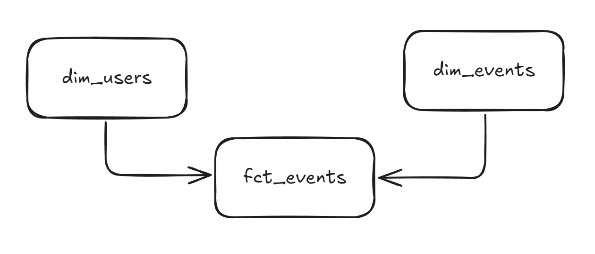

## DBT

- Assumed that user data might include additional attributes in the future (e.g., `user_email`), hence its inclusion.
- The schema follows a **star model**:
  - `fct_events` contains the relationships between user, event, tool, etc.
  - `dim_users` and `dim_events` include detailed attributes like email and event description.
- Added **unique keys** for all mart tables.
- Introduced an **intermediate table** to organize the modeling steps and generate surrogate keys.
- Documented all models and added **tests** for uniqueness and not-null constraints on keys.
- Materialization strategy:
  - `staging`: **view** (since it is a simple transformation and close to the source)
  - `intermediate` and `marts`: **table** (because they involve heavier logic and this aligns with common dbt best practices)

