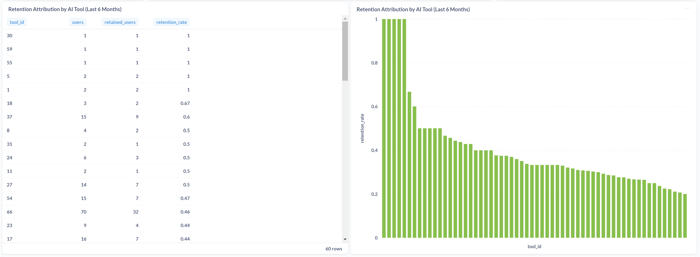

# Metabase

The sql queries are stored on the [`dbt/analyses/`](./dbt/analyses/) folder.

## Week 1 Retention (Cohort by Week)


```sql
WITH signup_events AS (
	-- CTE to calculate Day 0 (D0) for each user
    SELECT
        f.user_id,
        toStartOfWeek(f.occurred_at, 1) AS cohort_week_start, -- get the week of D0, starting on Monday
        f.occurred_at AS signup_date
    FROM fct_events f
    JOIN dim_events e ON f.event_id = e.event_id
    WHERE e.event_description = 'Finish onboarding'
),

retention_window_events AS (
-- CTE to identify users who had events between Day 7 and Day 13
    SELECT
        f.user_id
    FROM fct_events f
    JOIN signup_events s ON f.user_id = s.user_id
    -- inner join to only include users from the signup cohort
    -- right join could also work, but since one derives from the other, inner is fine
    WHERE f.occurred_at BETWEEN date_add(DAY, 7, s.signup_date)
                           AND date_add(DAY, 13, s.signup_date)
),

cohorts AS (
    SELECT
        s.cohort_week_start,
        COUNT(DISTINCT s.user_id) AS total_users,
        COUNT(DISTINCT r.user_id) AS retained_users
    FROM signup_events s
    LEFT JOIN retention_window_events r ON s.user_id = r.user_id
    -- left join to include users who signed up but were not retained
    GROUP BY s.cohort_week_start
)

SELECT
    cohort_week_start,
    total_users,
    retained_users,
    round(retained_users / total_users, 3) AS retention_rate
FROM cohorts
ORDER BY cohort_week_start -- bucket

```

## Funnel Analysis (1 Month - April 2023)


```sql
WITH signup_events AS (
  SELECT
    f.user_id AS user_id,
    MIN(occurred_at) AS signup_time
    -- captured the first "time" to use as a temporal reference
  FROM fct_events f
  JOIN dim_events e ON f.event_id = e.event_id
  WHERE e.event_description = 'Finish onboarding'
    AND toStartOfMonth(f.occurred_at) = toDate('2023-04-01') -- filter the desired month
  GROUP BY f.user_id
),

step1 AS (
  SELECT
    f.user_id AS user_id,
    f.occurred_at AS used_tool_time
    -- removed MIN because the user may use AI Tools multiple times before creating a lesson
    -- and any of those events might satisfy the funnel conditions, not necessarily the first
    -- see explanation below **
    -- MIN(f.occurred_at) AS used_tool_time
  FROM fct_events f
  JOIN dim_events e ON f.event_id = e.event_id
  JOIN signup_events s ON f.user_id = s.user_id
  WHERE e.event_description = 'Used AI Tool'
    AND f.occurred_at > s.signup_time
    -- might be redundant, but enforces the chronological relationship between events
    AND f.occurred_at <= date_add(DAY, 15, s.signup_time)
    -- constraint: the "Used AI Tool" event must occur at most 15 days after onboarding
  -- GROUP BY f.user_id
),

step2 AS (
  SELECT
    f.user_id AS user_id,
    MIN(f.occurred_at) AS created_lesson_time
  FROM fct_events f
  JOIN dim_events e ON f.event_id = e.event_id
  JOIN step1 s1 ON f.user_id = s1.user_id
  WHERE e.event_description = 'Create Lesson'
    AND f.occurred_at > s1.used_tool_time
    -- might be redundant, but enforces the chronological relationship between events
    AND f.occurred_at <= date_add(DAY, 15, s1.used_tool_time)
    -- constraint: the "Create Lesson" event must occur at most 15 days after the AI Tool was used
  GROUP BY f.user_id
)

-- union all to generate results in the required format
SELECT 'Finish onboarding' AS step, COUNT(DISTINCT s.user_id) AS users FROM signup_events s
UNION ALL
SELECT 'Used AI Tool', COUNT(DISTINCT s1.user_id) FROM step1 s1
UNION ALL
SELECT 'Create Lesson', COUNT(DISTINCT s2.user_id) FROM step2 s2
```
** Suppose a user completed onboarding and used an AI tool the next day. Then, 18 days later, they created a lesson.
If we kept the GROUP BY, this flow would be excluded, because the time between the AI tool and the lesson exceeds 15 days.
However, if the user used another AI tool 5 days after the first one, that second usage would satisfy the condition — and the user would be included in the funnel.

In the case of step2, it's fine to keep the MIN() aggregation, because creating the lesson once is enough for the user to count as converted.


## Bonus: Most Used Tool Right Before Creating a Lesson

```sql
-- Version that considers only the first lesson
WITH signup_events AS (
  SELECT
    f.user_id AS user_id,
    MIN(f.occurred_at) AS signup_time
  FROM fct_events f
  JOIN dim_events e ON f.event_id = e.event_id
  WHERE e.event_description = 'Finish onboarding'
    AND toStartOfMonth(f.occurred_at) = toDate('2023-04-01')
  GROUP BY f.user_id
),

step1 AS (
  SELECT
    f.user_id AS user_id,
	f.occurred_at AS used_tool_time
  FROM fct_events f
  JOIN dim_events e ON f.event_id = e.event_id
  JOIN signup_events s ON f.user_id = s.user_id
  WHERE e.event_description = 'Used AI Tool'
    AND f.occurred_at > s.signup_time
	AND f.occurred_at <= date_add(DAY, 15, s.signup_time)
),

step2 AS (
  SELECT
    f.user_id AS user_id,
    MIN(f.occurred_at) AS created_lesson_time
  FROM fct_events f
  JOIN dim_events e ON f.event_id = e.event_id
  JOIN step1 s1 ON f.user_id = s1.user_id
  WHERE e.event_description = 'Create Lesson'
    AND f.occurred_at > s1.used_tool_time
	AND f.occurred_at <= date_add(DAY, 15, s1.used_tool_time)
  GROUP BY f.user_id
),

tools_before_lesson AS (
  SELECT
    f.user_id,
    f.tool_id,
    f.occurred_at,
    ROW_NUMBER() OVER (PARTITION BY f.user_id ORDER BY f.occurred_at DESC) AS rn
  FROM fct_events f
  JOIN dim_events e ON f.event_id = e.event_id
  JOIN step2 s2 ON f.user_id = s2.user_id
  WHERE e.event_description = 'Used AI Tool'
    AND f.occurred_at < s2.created_lesson_time
)

SELECT
  tool_id,
  COUNT(*) AS used_before_create
FROM tools_before_lesson
WHERE rn = 1
GROUP BY tool_id
ORDER BY used_before_create DESC
LIMIT 5;
```

```sql
-- Version that considers all lesson events and their respective last-used AI tool before creation
WITH signup_events AS (
  SELECT
    f.user_id AS user_id,
    MIN(f.occurred_at) AS signup_time
  FROM fct_events f
  JOIN dim_events e ON f.event_id = e.event_id
  WHERE e.event_description = 'Finish onboarding'
    AND toStartOfMonth(f.occurred_at) = toDate('2023-04-01')
  GROUP BY f.user_id
),

step1 AS (
  SELECT
    f.user_id AS user_id,
    f.occurred_at AS used_tool_time
    -- MIN(f.occurred_at) AS used_tool_time
  FROM fct_events f
  JOIN dim_events e ON f.event_id = e.event_id
  JOIN signup_events s ON f.user_id = s.user_id
  WHERE e.event_description = 'Used AI Tool'
    AND f.occurred_at > s.signup_time
	AND f.occurred_at <= date_add(DAY, 15, s.signup_time)
  -- GROUP BY f.user_id
),

step2 AS (
  SELECT
    f.user_id AS user_id,
    f.occurred_at AS created_lesson_time
    --MIN(f.occurred_at) AS created_lesson_time
  FROM fct_events f
  JOIN dim_events e ON f.event_id = e.event_id
  JOIN step1 s1 ON f.user_id = s1.user_id
  WHERE e.event_description = 'Create Lesson'
    AND f.occurred_at > s1.used_tool_time
	AND f.occurred_at <= date_add(DAY, 15, s1.used_tool_time)
  -- GROUP BY f.user_id
),

tools_before_lesson AS (
  SELECT
    f.user_id,
    f.tool_id,
    f.occurred_at,
    ROW_NUMBER() OVER (PARTITION BY f.user_id, s2.created_lesson_time ORDER BY f.occurred_at DESC) AS rn
    -- it gets the higher "occurred_at", it means, the closets to each lesson
  FROM fct_events f
  JOIN dim_events e ON f.event_id = e.event_id
  JOIN step2 s2 ON f.user_id = s2.user_id
  WHERE e.event_description = 'Used AI Tool'
    AND f.occurred_at < s2.created_lesson_time
)

SELECT
  tool_id,
  COUNT(*) AS used_before_create
FROM tools_before_lesson
WHERE rn = 1
GROUP BY tool_id
ORDER BY used_before_create DESC
LIMIT 5;
```

## Retention Attribution by AI Tool (Last 6 Months)


```sql
WITH max_event_date AS (
-- CTE to get the latest month available in the dataset
  SELECT toStartOfMonth(MAX(occurred_at)) AS last_month
  FROM fct_events
),

onboarding_events AS (
  SELECT
    f.user_id AS user_id,
    MIN(f.occurred_at) AS signup_time
  FROM fct_events f
  JOIN dim_events e ON f.event_id = e.event_id
  JOIN max_event_date m ON 1 = 1
  WHERE e.event_description = 'Finish onboarding'
    AND f.occurred_at >= date_add(MONTH, -6, m.last_month)
  GROUP BY f.user_id
),

first_tool_used AS (
-- CTE to capture the first AI Tool used within the defined period
  SELECT
    f.user_id AS user_id,
    f.tool_id AS tool_id,
    MIN(f.occurred_at) AS first_tool_time
  FROM fct_events f
  JOIN dim_events e ON f.event_id = e.event_id
  JOIN onboarding_events o ON f.user_id = o.user_id
  WHERE e.event_description = 'Used AI Tool'
    AND f.occurred_at BETWEEN o.signup_time AND date_add(DAY, 6, o.signup_time)
    AND f.tool_id IS NOT NULL
  GROUP BY f.user_id, f.tool_id
  QUALIFY ROW_NUMBER() OVER (PARTITION BY f.user_id ORDER BY MIN(f.occurred_at)) = 1
),
-- The GROUP BY collects each user’s early tool usages
-- The QUALIFY clause ensures we only keep the very first one per user

week1_events AS (
  SELECT DISTINCT f.user_id AS user_id
  FROM fct_events f
  JOIN onboarding_events o ON f.user_id = o.user_id
  WHERE f.occurred_at BETWEEN date_add(DAY, 7, o.signup_time)
                          AND date_add(DAY, 13, o.signup_time)
)

SELECT
  t.tool_id as tool_id,
  COUNT(DISTINCT t.user_id) AS users,
  COUNT(DISTINCT w.user_id) AS retained_users,
  round(COUNT(DISTINCT w.user_id) / COUNT(DISTINCT t.user_id), 3) AS retention_rate
FROM first_tool_used t
LEFT JOIN week1_events w ON t.user_id = w.user_id
GROUP BY t.tool_id
ORDER BY retention_rate DESC;

```

## Best Predictive Event Pairs for Retention


### Scoring Techniques:

| Technique     | Description                                            | Formula                                       |
|---------------|--------------------------------------------------------|-----------------------------------------------|
| **Precision** | % of users with the pair who were retained             | `retained / users_with_pair`                  |
| **Recall**    | % of retained users who had the pair                   | `retained_with_pair / total_retained_users`   |
| **Lift**      | How much more likely retention is with the event pair | `retention_rate_with_pair / baseline_rate`    |
| **Heuristic** | Balanced measure used in this project                 | `retention_rate * log(users_with_pair)`       |

I chose the **heuristic** as the predictive power metric because:
- It is easy to compute
- It penalizes pairs with low support
- It rewards pairs that are both common and predictive

```sql
WITH signup_events AS (
  SELECT
    f.user_id AS user_id,
    MIN(f.occurred_at) AS signup_time
  FROM fct_events f
  JOIN dim_events e ON f.event_id = e.event_id
  WHERE e.event_description = 'Finish onboarding'
  GROUP BY f.user_id
),

day1_6_events AS (
  SELECT
    f.user_id AS user_id,
    d.event_description AS event_description,
    f.occurred_at AS occurred_at
  FROM fct_events f
  JOIN dim_events d ON f.event_id = d.event_id
  JOIN signup_events s ON f.user_id = s.user_id
  WHERE f.occurred_at BETWEEN date_add(DAY, 1, s.signup_time)
                          AND date_add(DAY, 6, s.signup_time)
),

event_pairs AS (
  SELECT
    a.user_id AS user_id,
    a.event_description AS event1,
    b.event_description AS event2
  FROM day1_6_events a
  JOIN day1_6_events b
    ON a.user_id = b.user_id AND a.event_description < b.event_description
),

retention_events AS (
  SELECT DISTINCT f.user_id AS user_id
  FROM fct_events f
  JOIN signup_events s ON f.user_id = s.user_id
  WHERE f.occurred_at BETWEEN date_add(DAY, 7, s.signup_time)
                          AND date_add(DAY, 13, s.signup_time)
),

paired_retention AS (
  SELECT
    ep.event1 AS event1,
    ep.event2 AS event2,
    COUNT(DISTINCT ep.user_id) AS users_with_pair,
    COUNT(DISTINCT r.user_id) AS retained,
    round(COUNT(DISTINCT r.user_id) / COUNT(DISTINCT ep.user_id), 3) AS retention_rate,
    round(COUNT(DISTINCT r.user_id) / COUNT(DISTINCT ep.user_id) * log(COUNT(DISTINCT ep.user_id)), 3) AS predictive_power_score
  FROM event_pairs ep
  LEFT JOIN retention_events r ON ep.user_id = r.user_id
  GROUP BY ep.event1, ep.event2
  HAVING users_with_pair >= 5 -- filter pairs with low records
  ORDER BY predictive_power_score DESC
  LIMIT 100 -- limit because the query is heavy
)

SELECT
  concat(event1, ' + ', event2) AS event_pair,
  users_with_pair,
  retained,
  retention_rate,
  predictive_power_score
FROM paired_retention;
```
