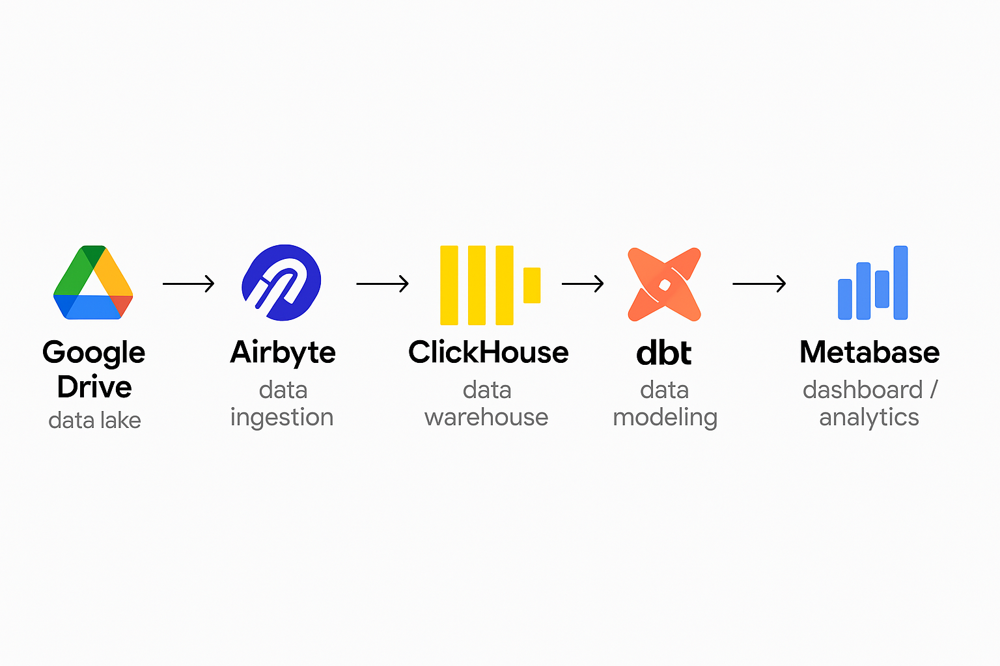
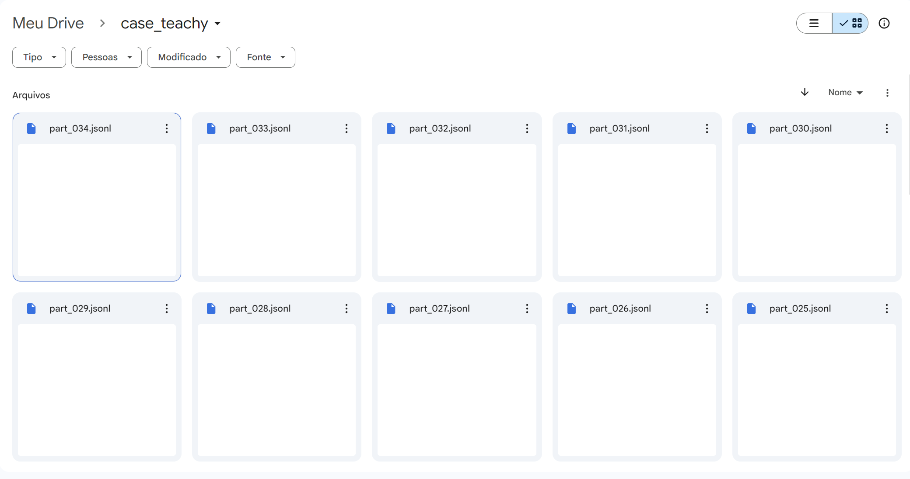

# ⚙️ Setup

### 🧭 Planning

After analyzing the case study's requirements, the following challenges and needs were identified:

- Semi-structured and large-volume JSON data (e.g., optional fields like `toolId`)
- Requirement to use a database or data warehouse
- Data transformations needed to clean and structure the dataset
- Analytical interface and dashboards required for insights and business questions

Based on these points, I selected the following stack for the project:



---

### 🔧 Stack Overview

#### 1. Google Drive

- Used as a **data lake** due to its free tier and ease of integration with other tools.
- Files were too large to ingest directly, so I split them into smaller batches using [`data_ingestion/split_file.py`](data_ingestion/split_file.py).
- In a production setup, this would likely be replaced by a more robust system like Amazon S3.



#### 2. Airbyte

- Chosen for **automated ingestion**, schema evolution, and change tracking:
  - Automatically maps optional fields, adjusting schemas dynamically.
  - Tracks data updates and ingests new files as they arrive.
  - Chosen for being **open-source** with solid support for both **Google Drive** and **ClickHouse**.
- Note: schema mapping for nested/optional fields is only available in the paid version. As a workaround, I created a parsed view manually (`data_ingestion/parsed_view.sql`).

#### 3. ClickHouse

- A powerful open-source **columnar data warehouse**, well-suited for analytical workloads.
- Chosen both due to the case suggestion and its strong compatibility with Airbyte and dbt.

#### 4. dbt

- Used for **data modeling** and **transformations** on top of raw ingested data.
- Offers great maintainability and versioning for SQL transformations.
- I used dbt for staging, intermediate, and mart-level modeling of events, users, and metrics.

#### 5. DBeaver

- Used for **querying and exploring** the ClickHouse database during development.
- Helpful for validation and debugging.
- Chosen for being free and having good native ClickHouse support.

#### 6. Metabase

- Chosen for the **visualization and dashboarding layer**.
- Open-source, simple to use, and integrates easily with ClickHouse.

---

### ⚙️ Configuration

#### 1. Google Drive

- Large JSON files were split manually for simplicity.
- In a real setup, ingestion would be automated via cloud sync or API-based uploads.
- OAuth credentials were created to authorize Airbyte to read from Drive:
  - Followed steps at: [Google OAuth Setup](https://cloud.google.com/looker/docs/looker-core-create-oauth?hl=pt-br)

#### 2. Airbyte

- Installed using `abctl`, which sets up Airbyte with Kubernetes (recommended over the now-deprecated Docker deployment).
- Setup instructions from: [Airbyte OSS Quickstart](https://docs.airbyte.com/using-airbyte/getting-started/oss-quickstart)
- Configured connectors for:
  - [Google Drive Source](https://docs.airbyte.com/integrations/sources/google-drive)
  - [ClickHouse Destination](https://docs.airbyte.com/integrations/destinations/clickhouse)

#### 3. ClickHouse

- Deployed via Kubernetes for easier integration with Airbyte (avoids networking issues like firewall config).
- Configuration defined in `server/clickhouse.yaml`.
- Deployed using the following commands:

```powershell
$env:KUBECONFIG = "$HOME\.airbyte\abctl\abctl.kubeconfig"

kubectl apply -f clickhouse.yaml -n airbyte-abctl

kubectl port-forward -n airbyte-abctl service/clickhouse 8123:8123
```

- These were executed manually for simplicity, but could be automated in production.

#### 4. DBeaver

- Installed using the standard Windows installer.
- Connection configured with credentials from `clickhouse.yaml`.

#### 5. dbt

- Installed using Python pip, following [ClickHouse dbt setup guide](https://clickhouse.com/docs/integrations/dbt).

#### 6. Metabase

- Deployed via Kubernetes using `server/metabase.yaml`.
- Accessed via port-forward with a command similar to ClickHouse (changing the service name).